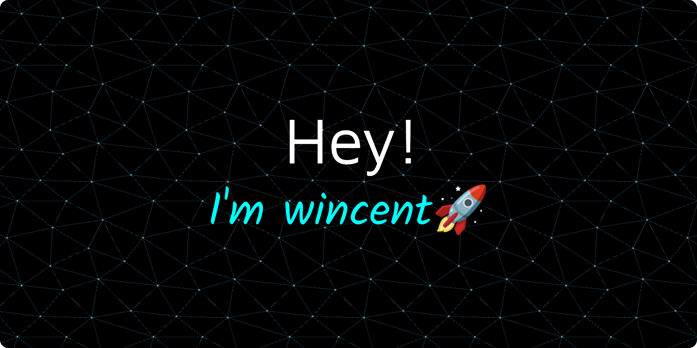

  

I am a **Web Developer** specializing in creating **responsive** and **dynamic** websites. With expertise in HTML, CSS, JavaScript, and frameworks like React and Node.js, I build user-friendly and efficient web applications. I am dedicated to continuous learning and staying current with the latest web development trends and technologies.

- 💼 Got a freelance gig? Hit me up via <a href="gallardowin28@gmail.com">email.</a>
- 💬 Curious? Just ask!

